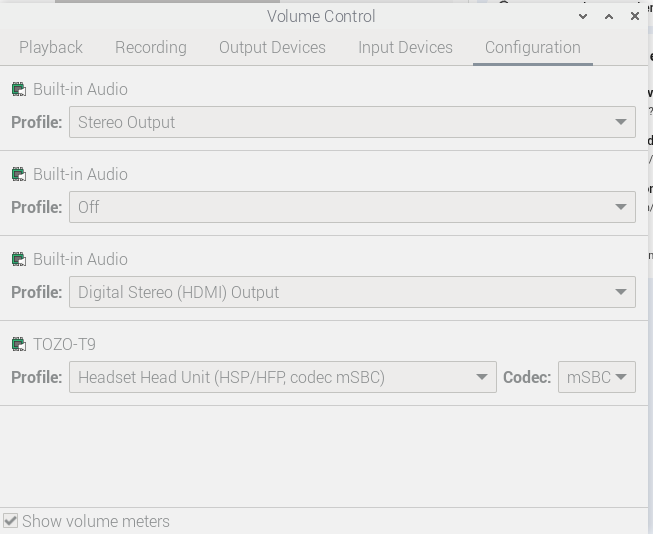
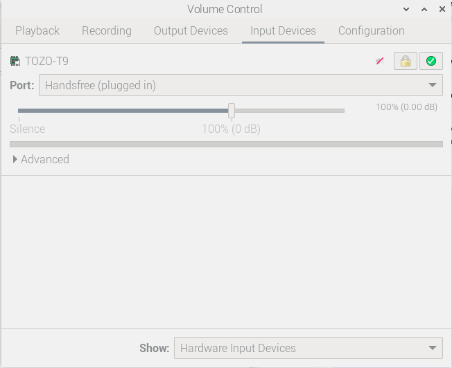

# Generative AI application for Assisting Visually Challenged people

- The idea is to allow visually challenged people to understand their
    environment better by using Generative AI.
- The user can interact with the device using touch and voice. The user has to press
a button to give verbal commands. The response is generated once the button is released.
- The user can ask specific questions about the environment and receive clear and
precise answers to their queries.

## Dependencies:
- Hardware
    - Raspberry Pi 4 Board with minimum 4GB RAM
    - Picamera version 2
    - Push Button
    - (Bluetooth) Microphone / Speaker head-set for voice interaction 
    - Battery bank to make the device portable (optional)
- Software:
    - Raspberry Pi OS (Bookworm)
    - PiCamera2 Library (available by default on bookworm)
    - Vosk for speech recognition
    - Piper for text to speech
    - Access to Generative AI APIs (Gemini)

## Installation
Create a python virtual environment to install the respective packages
```
sudo apt update
sudo apt install python3-venv
python3 -m venv ~/geminivenv --system-site packages
```
The option `--system-site-packages` allows the virtualenv to access the system-site packages.

Now activate this virtual environment and install the packages necessary for this application.

```
source ~/geminivenv/bin/activate
(geminivenv) $
```
### Capturing audio from Microphone
Install PyAudio for recording audio from microphone and save it as a `wav` file. file
```
sudo apt-get install portaudio19-dev python3-dev
pip3 install pyaudio
```

### Speech to Text conversion using Vosk
Install [Vosk](https://alphacephei.com/vosk/) for speech recognition. Also download `vosk-model-en-us-0.15` into your home folder. Its size is about 40MB. 
```
pip3 install vosk
wget https://alphacephei.com/vosk/models/vosk-model-small-en-us-0.15.zip -O /home/pi/vosk-model-small-en-us-0.15.zip
unzip vosk-model-small-en-us-0.15.zip

```
Make sure that this path is correctly provided to the function `speech-to-text()` function in `stt.py` file.

### Text to speech conversion using Piper
Install the following packages for installing `piper` module
```
sudo apt update
sudo apt install -y python3-pip libsndfile1
pip3 install piper-tts
```
Download the piper models from Hugging face into `/home/pi/en-us-lessac-medium/` folder
```
# Create directory for the model
mkdir -p /home/pi/en-us-lessac-medium

# Download model and config files
wget https://huggingface.co/rhasspy/piper-voices/resolve/v1.0.0/en/en_US/lessac/medium/en_US-lessac-medium.onnx?download=true -O /home/pi/en-us-lessac-medium/en-us-lessac-medium.onnx
wget https://huggingface.co/rhasspy/piper-voices/resolve/v1.0.0/en/en_US/lessac/medium/en_US-lessac-medium.onnx.json?download=true -O /home/pi/en-us-lessac-medium/en-us-lessac-medium.onnx.json

# Verify files
ls -lh /home/pi/en-us-lessac-medium
total 61M
-rw-r--r-- 1 pi pi  61M Sep  5 09:46 en-us-lessac-medium.onnx
-rw-r--r-- 1 pi pi 4.8K Sep  5 09:46 en-us-lessac-medium.onnx.json

```
Make sure that the piper model path is correctly provided in the `speak()` function in `tts.py` file.

### Setting up Google Gemini
Install google generative ai python package using `pip`. 

```
pip3 install google-generativeai
```
Obtain Gemini API Key from [Google AI studio](https://ai.google.dev/aistudio) by logging into your account. Save this API key as an environment variable in your `~/.bashrc` script 
```
export GEMINI_API_KEY=xxxx
```
This key is accessed by the file `gemini.py` script. Please note that accessing Gemini API may incur charges. 
### PiCamera2 Library
`Picamera2` library is installed by default on Bookworm. If not, you may install using the following commands
```
sudo apt update && sudo apt upgrade -y
sudo apt install -y python3-picamera2
pip3 install pillow
```
Also, you need to enable the Picamera using `raspi-config` tool. 

## Getting Bluetooth headphone/microphone to work properly
You can use the Desktop Bluetooth application to connect to your wireless headset. Make sure that the following
modules are installed on your system.
```
sudo apt install --reinstall pulseaudio pulseaudio-module-bluetooth libportaudio2 portaudio19-dev
```
To check the connected device. Type the following command. You should be inside your bluetooth device folder
as a root. Now you can type several commands to check the status of the connection. Type `exit` to come out
of your device. In my case, the name of the bluetooth device is `TOZO-T9`.
```
geminivenv) pi@raspberrypi:~/geminivenv $ bluetoothctl
Agent registered
[TOZO-T9]# devices Paired
Device 58:FC:C6:0D:62:0D TOZO-T9
devices Connected
Device 58:FC:C6:0D:62:0D TOZO-T9
[TOZO-T9]# devices Connected
Device 58:FC:C6:0D:62:0D TOZO-T9
[TOZO-T9]# info 58:FC:C6:0D:62:0D
Device 58:FC:C6:0D:62:0D (public)
	Name: TOZO-T9
	Alias: TOZO-T9
	Class: 0x00240404
	Icon: audio-headset
	Paired: yes
	Bonded: yes
	Trusted: yes
	Blocked: no
	Connected: yes
	LegacyPairing: no
	UUID: Serial Port               (00001101-0000-1000-8000-00805f9b34fb)
	UUID: Audio Sink                (0000110b-0000-1000-8000-00805f9b34fb)
	UUID: A/V Remote Control Target (0000110c-0000-1000-8000-00805f9b34fb)
	UUID: Advanced Audio Distribu.. (0000110d-0000-1000-8000-00805f9b34fb)
	UUID: A/V Remote Control        (0000110e-0000-1000-8000-00805f9b34fb)
	UUID: Handsfree                 (0000111e-0000-1000-8000-00805f9b34fb)
	UUID: PnP Information           (00001200-0000-1000-8000-00805f9b34fb)
	UUID: Unknown                   (0000e003-0000-1000-8000-00805f9b34fb)
	Modalias: bluetooth:v03E0p301Bd0100
[TOZO-T9]# exit
(geminivenv) pi@raspberrypi:~/geminivenv $ 
```
Now verify the bluetooth microphone in PulseAudio
```
pactl list sources
```
Look for a source audio source with HSP/HFD profile as shown below:
```
Source #N
    State: RUNNING
    Name: bluez_source.XX_XX_XX_XX_XX_XX.hsphfpd
    Description: TOZO-T9
```
If you see `.a2dp_source`, the microphone won’t work, as A2DP is for playback only. You need to change the
the profile of your device using the following command
```
sudo apt install pavucontrol
pavucontrol
```
In the Configuration tab, ensure the TOZO-T9 is set to HSP/HFP (not A2DP). In the input devices tab,
select the TOZO-T9 device. Speak into the microphone and check if the volume bar moves. If the volume bar
does not move as you speak, then your device is not working. Configuration on my system appears as shown below

| Config tab | Input tab |
| -----     |  ---- |
|  |  |

Check the status of your device again.
```
pactl list sources
Source #177
	State: SUSPENDED
	Name: bluez_input.58_FC_C6_0D_62_0D.0
	Description: TOZO-T9
	Driver: PipeWire
	Sample Specification: s16le 1ch 16000Hz
	Channel Map: mono
	Owner Module: 4294967295
	Mute: no
	Volume: mono: 65536 / 100% / 0.00 dB
	        balance 0.00
	Base Volume: 65536 / 100% / 0.00 dB
	Monitor of Sink: n/a
	Latency: 0 usec, configured 0 usec
	Flags: HARDWARE DECIBEL_VOLUME LATENCY 
	Properties:
		api.bluez5.address = "58:FC:C6:0D:62:0D"
		api.bluez5.codec = "msbc"
		api.bluez5.profile = "headset-head-unit"
		api.bluez5.transport = ""
		card.profile.device = "0"
		device.id = "86"
		device.intended_roles = "Communication"
		device.routes = "1"
		factory.name = "api.bluez5.sco.source"
		device.description = "TOZO-T9"
		node.name = "bluez_input.58_FC_C6_0D_62_0D.0"
		node.pause-on-idle = "false"
		priority.driver = "2010"
		priority.session = "2010"
		factory.id = "9"
		clock.quantum-limit = "8192"
		device.api = "bluez5"
		media.class = "Audio/Source"
		node.driver = "true"
		port.group = "stream.0"
		node.loop.name = "data-loop.0"
		library.name = "audioconvert/libspa-audioconvert"
		object.id = "91"
		object.serial = "177"
		client.id = "36"
		api.bluez5.class = "0x240404"
		api.bluez5.connection = "disconnected"
		api.bluez5.device = ""
		api.bluez5.icon = "audio-headset"
		api.bluez5.path = "/org/bluez/hci0/dev_58_FC_C6_0D_62_0D"
		bluez5.auto-connect = "[ hfp_hf hsp_hs a2dp_sink ]"
		bluez5.profile = "off"
		device.alias = "TOZO-T9"
		device.bus = "bluetooth"
		device.form_factor = "headset"
		device.icon_name = "audio-headset-bluetooth"
		device.name = "bluez_card.58_FC_C6_0D_62_0D"
		device.product.id = "0x301b"
		device.string = "58:FC:C6:0D:62:0D"
		device.vendor.id = "bluetooth:03e0"
	Ports:
		headset-input: Handsfree (type: Headset, priority: 0, available)
	Active Port: headset-input
	Formats:
		pcm


```
The parameters of source #177 such as `api.bluez5.profile = "headset-head-unit"`, `media.class = "Audio/Source"`
and `bluez5.auto-connect = "[ hfp_hf hsp_hs a2dp_sink ]"` indicate that our bluetooth device is properly configured.

Test the device to record and play a sample voice as shown below
```
(geminivenv) pi@raspberrypi:~/geminivenv $ parecord -d bluez_input.58_FC_C6_0D_62_0D.0 test.wav
(geminivenv) pi@raspberrypi:~/geminivenv $ paplay test.wav 
``` 
press `Ctrl+c` to stop recording after the first command. You should be able to hear back what you recorded.

## Running this application
Clone your repository in your home folder
```
git clone https://github.com/swagatk/Raspi_codes.git
cd ~/Raspi_codes/genai_app/
```
Run the following command after activating your virtual environment created above
```
(geminivenv) pi@raspberrypi:~/Raspi_codes/genai_app $ python3 ./genai_app.py 
```
You should see the following console output as the application executes:
```
Using device: pulse
Recording ...
Button detected. record while pressed
Recording stopped
saving to input.wav....
Audio saved successfully as input.wav
file saved as /home/pi/Pictures/test.jpg
prompt:what do you see
Response: Directly ahead is a desk. On the desk are a laptop, two monitors, a keyboard, a mouse, and orange headphones.
Speech saved to output.wav
^CExiting program
GPIO cleaned up

```

## Automatically start application on reboot
We use autorun.desktop script to launch the application on reboot. 
For this you will have to first create a `autostart` folder as follows: 
```
mkdir -p ~/.config/autostart
```
Create a file inside this folder:
```
nano ~/.config/autostart/isight.desktop
```
Add the following content to the file:
```
[Desktop Entry]
Name=iSight
Comment=Start iSight Python application at login
Exec=lxterminal -e /home/pi/geminivenv/bin/python3 /home/pi/Raspi_codes/genai_app/genai_app.py
Terminal=false
Type=Application
```
This script can not access the `GEMINI_API_KEY` defined in `~/.bashrc` file. So, define this key inside the `~/.profile` file instead. 

Since we are installing packages inside a python virtual environment, make sure to use the correction python interpreter to execute your script file. Save the above file and reboot the system to see the effect. 

## Credits / Acknowledgement
- This application was originally developed by Luke Irven, a former student at Edge
Hill University under my supervision. The original source codes for this device could be found at
his [GitHub site](https://github.com/lirven/iSight)
- Changes compared to original version are as follows:
    - Using a Bluetooth headset to interact with the device.
    - Using `piper` library instead of `espeak` library for text-to-speech conversion
    - Code reorganization for better error handling. 
    

