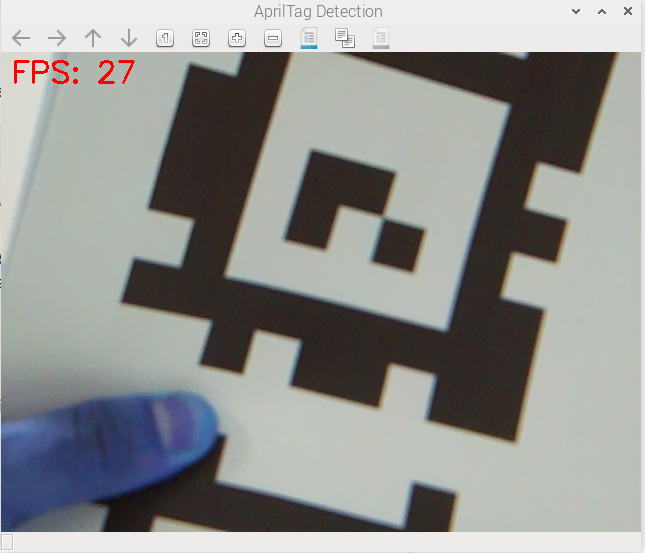

# AprilTag Detection


## Installation
Clone the `apriltag` repo: 

```
git clone https://github.com/AprilRobotics/apriltag.git
```

Now build the package
```
cd apriltags
cmake -B build -DCMAKE_BUILD_TYPE=Release
cmake --build build
sudo cmake --target install
```
Check that the python libraries are built:

```
# Check if the shared C library exists (The "Engine")
ls -l /usr/local/lib/libapriltag.so
lrwxrwxrwx 1 root root 16 Dec  1 11:57 /usr/local/lib/libapriltag.so -> libapriltag.so.3

# Check if the Python wrapper exists (The "Steering Wheel")
# It usually installs to one of these locations:
ls -l /usr/local/lib/python3*/site-packages/apriltag*
-rw-r--r-- 1 root root 73360 Dec  1 11:57 /usr/local/lib/python3.11/site-packages/apriltag.cpython-311-aarch64-linux-gnu.so
```

Update the linker to find this python library
```
echo "/usr/local/lib" | sudo tee /etc/ld.so.conf.d/usr-local-lib.conf
sudo ldconfig
```
Add the following line in your script that uses `apriltag` module:

```
import sys
# Tell Python where to find the installed apriltag module
sys.path.append('/usr/local/lib/python3.11/site-packages')

import cv2
import apriltag 
# ... rest of your code
```
Now you can execute your code as follows:
```
python3 ./apriltag_detection_live.py
```

### Screenshots

